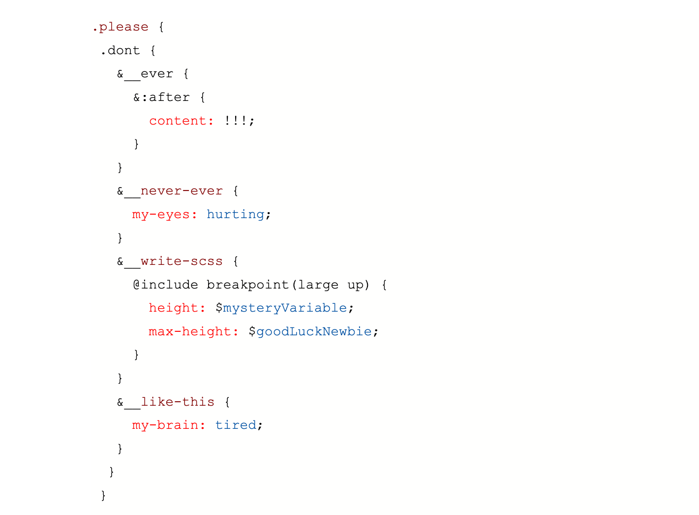
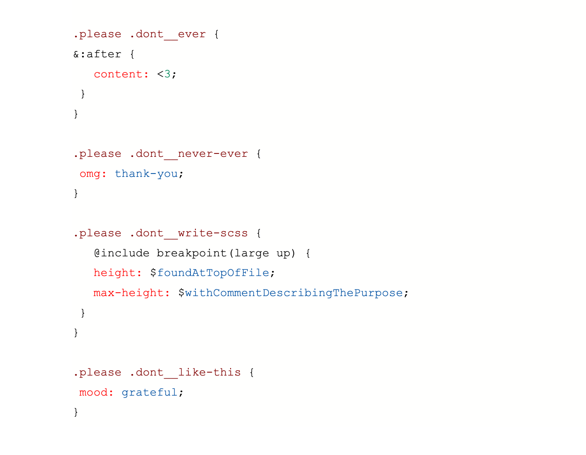

<title>Writing</title>

# The Original Purpose of the Hyperlink

_The eccentric and lofty goals held by the creator of the hyperlink_

I don't remember why I needed to google the "history of the hyperlink," but I'm deeply intrigued with what I found. The man who coined the term “hyperlink” had a massive vision for what links could be and what they were meant to do.

Hyperlinks were intended to be a tool that facilitated multiple connections between every piece of literature known to humankind. Wikipedia's one-way links fall so short of the lofty, esoteric end goal of infinitely linked literature that motivated him to develop hyperlinks.

So imagine an interface that is a scrollable carousel of an endless stack of deliberately organized papers. To swipe through would be to pull the next page out of the boundless stack and into focus. Each piece of literature is placed with the writing that inspired it and the writing that was inspired by it. Can you imagine?

For example, the original publication of The Trial would be preceded by the books Franz Kafka read as a youth, followed by the editor notes of his published work as an adult, alongside connections to every reference his own literature makes to other literature, in addition to all the literature that references his.

So the contemporary commentary, translations, impressions, poems, and criticisms of every piece of literature would exist together in a sort of chronological cyberspace library meant to capture all of humankind's inherited knowledge.

I begged an AI image generator to create a representation of this scholarly, LSD-inspired, poetry-repository thing, but the glitchy blue paper swarm featured above was its best attempt.
If you would like to learn about something interesting and strange while procrastinating whatever you're supposed to be doing—you could do way worse than googling "Ted Nelson Project Xanadu 1964."

Is this idea something that could bring an element of humanity to information architecture that the internet needs, or is it too far up the ivory towers to take seriously? I can't decide.

Fall into this philosophy/technology rabbit hole here -> [xanadu.net](https://www.xanadu.net/)

# An Apprentice's Plea

_An argument for clarity over brevity_

I printed my first “Hello World!” to the console using JavaScript around this time last year. Throughout my LaunchCode education and this apprenticeship that followed, I have found that the most difficult part of my coding journey has been processing complexity.

For example, when I was studying English in college, it wouldn’t have been acceptable to present a new theory on a text that I hadn’t read front to back and didn’t fully understand. When I add a feature to a codebase that sometimes works in mysterious ways, it feels like I am doing exactly that.

I think this part of my coding journey could be made easier if I could find ONE CSS class!!!

So please, regard my plea. Stop using SCSS to write class names in that strange, choppy, nested way; they can’t be searched for by their names within your IDE and don’t reflect how they are rendered in your browser’s dev tools. It drives me nuts.

Just for fun— here are those same classes, but placed beside their parents and stretched out to their full names (in exception to the “after” pseudo class).

# Strengthening your Foundational Web Development Skills

_Learn where languages started to understand where they are going_

Web Development frameworks like Angular, React, and Bootstrap offer solutions that prevent developers from having to code everything from scratch. Often junior devs are learning web frameworks along with the foundational languages. This is necessary in order to catch up with modern tech teams-- but it’s kind of like learning how to run and how to walk at the same time!

**Benefits of building your HTML, CSS and JavaScript skills:**

- Understand the quality of a framework tool by learning what labor is being done behind the scenes
- Build expertise in debugging framework issues by understanding what the framework is doing (or not doing) for you
- Trim unnecessary dependencies from your project by discovering if the goals of your project can be accomplished by foundational languages
- Boost your accessibility skills by learning the native semantics of HTML. Screen readers and tab orders expect buttons to be tagged as the old school `<button></button>` for example. If frameworks are used to develop an alternative to the traditional button tag, then workarounds will be needed to make your website compatible with screen readers.
- Boost your test automation skills by learning the native semantics of HTML. Test automation frameworks like Selenium also expect native HTML semantics for web components in order to interact with them properly.

Let’s take a walk and build a website using only JavaScript, HTML, and CSS:

## Step 1: Create a GitHub account

If you don't already have a GitHub account, visit [https://github.com/join](https://github.com/join) to create one. It's free!

## Step 2: Create a new repository

Click on the "+" icon in the upper right corner of your GitHub dashboard, then select "New repository". Name your repository. If you want your site to be accessible at "yourusername.github.io", you must name the repository as "yourusername.github.io" (replace "yourusername" with your actual GitHub username).

## Step 3: Initialize your repository

Choose to initialize your repository with a README file, or without one if you prefer. You can also add a .gitignore file if you wish, though it's not necessary for a basic HTML, CSS, and JavaScript site.

## Step 4: Upload your files

Click on the "Add file" button and then "Upload files". You can then drag and drop your files or click to select files from your computer. Upload your HTML, CSS, and JavaScript files here.

Your HTML file should be named "index.html", this will be the default landing page for your site. Your CSS and JavaScript files can be named whatever you like, but remember to correctly link them in your HTML file.

## Step 5: Commit your files

After uploading your files, scroll down to find the "Commit changes" section. Here, type in a brief message describing the files you're adding, then click "Commit changes".

## Step 6: Configure GitHub Pages

Go to the "Settings" tab of your repository, scroll down to the "GitHub Pages" section. Under the "Source" subheading, select the branch you want to use (for most, this will be "main" or "master") and the root ("/") as your folder. Click "Save".

## Step 7: Access your site

After you've saved your GitHub Pages settings, GitHub will provide you with a URL where your site is hosted. This will typically be "https://yourusername.github.io/repositoryname".

> Remember, it may take a few minutes for your site to be accessible after you've saved your settings, so don't worry if it's not immediately available.

Boom. You now have a website with only HTML, CSS, and JavaScript hosted for free by GitHub Pages. 

Now that the boring part is complete, use this foundation to implement something fun. Maybe configure a [JavaScript art visual](https://editor.p5js.org/tkolkmeyer/sketches/SDXS-GFSM) to fit your website. You can also create a [name generator](https://theunlikelydeveloper.com/random-name-generator-javascript/), [the game of life](https://thecodingtrain.com/challenges/85-the-game-of-life), or a [photo filter](https://editor.p5js.org/tkolkmeyer/sketches/dl-Tx7mXC). 

Challenge yourself to avoid using any front-end frameworks in order to build your skills in foundational languages. As engineers, we’ve got to learn where languages started to understand where they are going!

 